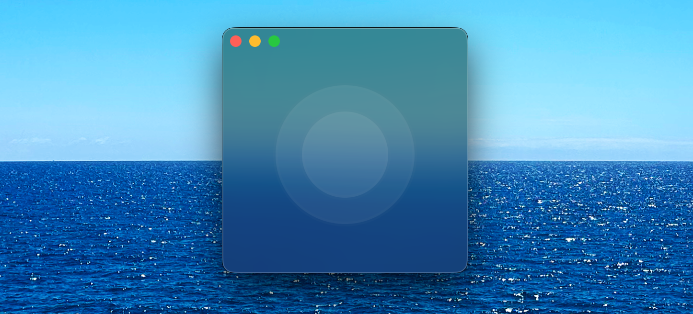

# JoyPanTlt

A real-time joystick to OSC (Open Sound Control) and MIDI converter application for macOS. Control your audio/visual software, synthesizers, and digital audio workstations using joystick input with customizable mapping and routing.

## Features

- Real-time joystick input
- OSC message output
- MIDI Control Change (CC) and Note output
- Multiple joystick support
- Built with Swift and Core Audio/Core MIDI frameworks

## Requirements

- macOS 10.15 (Catalina) or later
- Xcode 12.0 or later (for building from source)

## Installation

### From Source
1. Clone this repository
2. Open `JoyPanTlt.xcodeproj` in Xcode
3. Build and run the project

## Usage

1. Connect your joystick/controller to your Mac
2. Launch JoyPanTlt
3. Configure your OSC and/or MIDI output settings
4. Map joystick controls to desired OSC addresses or MIDI CC numbers

## Configuration

Configuration files are stored in `~/Library/Application Support/JoyPanTlt/`

## TODO

- Joystick graphics when using more then 1 virual joystick

## Acknowledgments

- Built using Swift and Apple's Core Audio/Core MIDI frameworks
- OSC implementation based on SwiftOSC library
